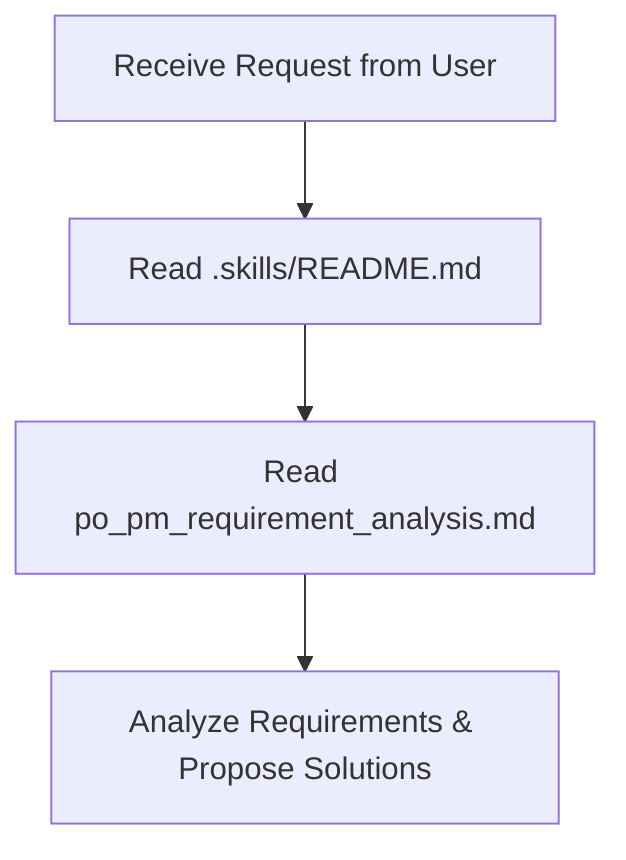

# 🧠 AI Agent Skills & Rules System - king-tech

Welcome (AI Agent) to the **king-tech** project. To help you understand the project deeply and operate efficiently, this directory contains a standardized set of skills.

> 🚨 **MANDATORY REQUIREMENT:** Whenever you start a new session or receive a complex task, you must read this file and related skill files (using the file viewer tool with the `IsSkillFile: true` attribute if available) to equip yourself with the necessary knowledge.

---

## 🗺️ Skills Map

The `.skills/` directory is currently focused on the core Product Owner & Product Manager role:

| File | Skill & Role | Detailed Content |
| :--- | :--- | :--- |
| [po_pm_requirement_analysis.md](file:///Users/ththiep/Sources/king-tech/.skills/po_pm_requirement_analysis.md) | **Product Owner & Product Manager** | Guides on receiving requirements, asking clarifying questions, designing User Flow/UX logic, writing Gherkin-standard User Stories & Acceptance Criteria, and analyzing technical risks. |

---

## 🚀 How AI Should Activate Skills

When executing any task in this project, you must follow this workflow:

### Quick Application:
1. **Active Listening:** Carefully read the user's request.
2. **Auto-Activation:** Directly read the `po_pm_requirement_analysis.md` file to immediately apply the defined structures and templates.
3. **Standardized Responses:** Use the provided templates in the skill file to respond to the user, creating a professional, clear, and consistent experience.

---

## ✍️ Updates & Expansion
This skills system is a living document. If, during development, you need to add more technical skills, discuss them with the user and directly update the files in this directory.
