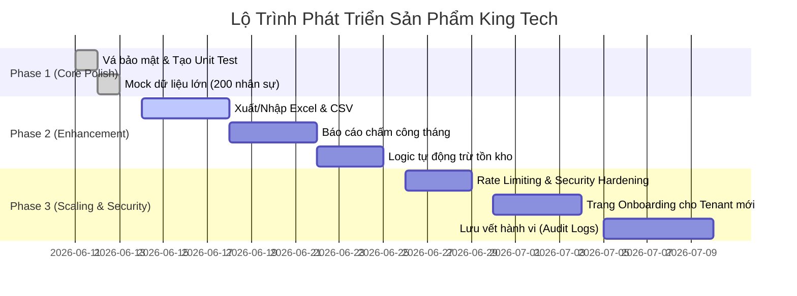

# Báo Cáo Đánh Giá Dự Án Dưới Góc Nhìn Product Manager / Product Owner (PM/PO)

Báo cáo này tập trung phân tích dự án **King Tech Backend** dưới lăng kính quản trị sản phẩm, bao gồm việc đánh giá các tính năng hiện có, trải nghiệm lập trình (DX), phân tích rủi ro/nợ kỹ thuật, lộ trình phát triển và các câu hỏi định hướng sản phẩm tiếp theo.

---

## 📌 1. Tổng Quan Sản Phẩm (Product Overview)

Dự án **King Tech Backend** là hệ thống Backend đa doanh nghiệp (Multi-tenant) phục vụ cho nền tảng quản trị nhân sự (HRM), quản lý chấm công và quản trị bán hàng nhỏ lẻ cho các doanh nghiệp khách hàng (Tenants - ví dụ: `kingtech`, `nhatnam`). 

Hệ thống được thiết kế theo mô hình **Clean Architecture (Controller - Service - Repository)** nhằm đảm bảo tính cô lập dữ liệu tuyệt đối (tenant isolation), tối ưu hóa hiệu năng và khả năng mở rộng nhanh chóng trong tương lai.

---

## 🎯 2. Đánh Giá Các Tính Năng Hiện Có (Feature Audit)

### 2.1. Đăng Nhập & Phân Quyền Multi-Tenant (Auth & Tenant Isolation)
*   **Trạng thái:** Hoàn thành (Done)
*   **Góc nhìn PO:** 
    *   *Điểm cộng:* Cơ chế đưa `tenant` vào cấu trúc JWT token và tự động ép điều kiện truy vấn `eq("tenant", tenant)` ở tầng Repository hoạt động cực kỳ mượt mà. Nó đảm bảo dữ liệu của công ty nào thì chỉ công ty đó được thấy, ngăn ngừa 100% rủi ro rò rỉ dữ liệu chéo (Cross-tenant leaks).
    *   *Điểm cần cải tiến:* Chưa có API hoặc cổng đăng ký tự động (Self-service Onboarding) dành cho Tenant mới. Việc thêm mới doanh nghiệp hiện tại vẫn phải can thiệp thủ công vào cơ sở dữ liệu.

### 2.2. Quản Lý Nhân Sự (Employee Management)
*   **Trạng thái:** Hoàn thành (Done)
*   **Góc nhìn PO:**
    *   *Điểm cộng:* Hỗ trợ đầy đủ các thao tác CRUD. Có sẵn các API thêm hàng loạt (Batch Create) và xóa hàng loạt (Batch Delete) rất tối ưu cho các thao tác số lượng lớn. Dữ liệu đầu vào được kiểm duyệt chặt chẽ bởi Zod validation (ví dụ: khống chế limit tối đa 1000 bản ghi để tránh quá tải server).
    *   *Điểm cần cải tiến:* 
        *   **Thiếu xuất/nhập Excel/CSV:** Với quy mô quản lý hàng trăm nhân sự (vừa mock 200 nhân sự), việc phải điền form từng người là một rào cản UX rất lớn. Cần bổ sung tính năng import/export file Excel.
        *   **Quản lý bộ nhớ Avatar:** Khi nhân sự cập nhật ảnh đại diện mới qua API Upload, ảnh cũ trên Supabase Storage vẫn tồn tại mà không bị xóa đi, lâu dài sẽ gây lãng phí dung lượng lưu trữ.

### 2.3. Chấm Công (Attendance Management)
*   **Trạng thái:** Hoàn thành (Done - Đã vá lỗ hổng bảo mật)
*   **Góc nhìn PO:**
    *   *Điểm cộng:* Module cho phép ghi nhận trạng thái chuyên cần (`Có mặt`, `Trễ`, `Nghỉ phép`, `Vắng`), số giờ làm việc thực tế và tăng ca của từng nhân viên theo từng ngày. Việc vá lỗi bảo mật (xác thực nhân viên có thuộc tenant hiện tại hay không trước khi chấm công) đã giúp hệ thống đạt độ an toàn cao.
    *   *Điểm cần cải tiến:*
        *   **Thiếu báo cáo tổng hợp tháng:** Để phục vụ cho việc tính lương, PO cần một API trả về bảng tổng hợp công của cả tháng (ví dụ: Nhân viên A trong tháng 6 đi làm bao nhiêu ngày, đi trễ bao nhiêu lần, tăng ca bao nhiêu giờ).
        *   **Thiếu cấu hình giờ chuẩn:** Hiện tại việc xác định đi trễ (`late`) đang được gửi chủ động từ client. Tốt nhất nên có cấu hình giờ làm việc chung của công ty để Backend tự động tính toán trạng thái này dựa trên thời gian check-in thực tế.

### 2.4. Quản Lý Sản Phẩm & Đơn Hàng (Product & Order Management)
*   **Trạng thái:** Hoàn thành (Done)
*   **Góc nhìn PO:**
    *   *Điểm cộng:* Module cung cấp đủ thông tin cốt lõi gồm SKU sản phẩm, danh mục, giá cả, tồn kho và các trường thông tin khách hàng, tổng tiền trong đơn hàng.
    *   *Điểm cần cải tiến:*
        *   **Chưa tự động trừ tồn kho:** Khi tạo đơn hàng thành công, số lượng tồn kho (`inventory`) của sản phẩm tương ứng chưa được tự động trừ đi. Đây là logic nghiệp vụ bắt buộc phải bổ sung.
        *   **Thiếu giao dịch (Transaction):** Việc trừ kho và tạo đơn cần đặt trong một Database Transaction để tránh trường hợp tạo đơn thành công nhưng trừ kho thất bại (hoặc ngược lại).

### 2.5. Cấu Hình Hệ Thống (Settings Management)
*   **Trạng thái:** Hoàn thành (Done)
*   **Góc nhìn PO:**
    *   *Điểm cộng:* Thiết kế rất linh hoạt. Cho phép mỗi Tenant tự cấu hình danh sách Phòng ban (`departments`), Trạng thái làm việc (`workStatuses`) và Trạng thái chấm công (`attendanceStatuses`) với nhãn tiếng Việt/tiếng Anh và màu sắc hiển thị (tone) riêng biệt. Nếu doanh nghiệp chưa cấu hình, hệ thống sẽ tự động fallback về cấu hình mặc định sẵn có.

---

## 🎨 3. Đánh Giá Trải Nghiệm Lập Trình & Thiết Kế API (DX & API Design)

*   **RESTful Standard:** Thiết kế endpoint khoa học và nhất quán (ví dụ: `/api/v1/employees/:id`), sử dụng đúng các phương thức HTTP.
*   **Kiểm duyệt dữ liệu chặt chẽ:** Tích hợp Zod Validation ở lớp Middleware giúp chặn đứng dữ liệu rác trước khi truyền xuống Service/Repository.
*   **Cơ chế bắt lỗi tinh tế:** Việc bắt lỗi `Range Not Satisfiable (PGRST103)` khi client yêu cầu trang dữ liệu vượt quá giới hạn và trả về mảng rỗng `[]` thay vì văng lỗi 500 là điểm cộng cực lớn cho trải nghiệm tích hợp Frontend.
*   **Bảo mật môi trường:** Việc chia cấu hình thành `.env.development` và `.env.production` cùng file `.vscode/launch.json` giúp nhà phát triển dễ dàng chuyển đổi môi trường test an toàn, không lo lộ key sản phẩm.

---

## 🛑 4. Các Khoản Nợ Kỹ Thuật & Rủi Ro (Technical Debt & Risks)

1.  **Thiếu Rate Limiting:** API đăng nhập (`/api/v1/auth/login`) và API upload ảnh (`/api/v1/upload`) chưa giới hạn tần suất gọi. Kẻ xấu có thể lợi dụng để spam dò mật khẩu (brute-force) hoặc spam tải file gây cạn kiệt băng thông và tài nguyên lưu trữ.
2.  **Thiếu Hệ Thống Lưu Vết (Audit Logs):** Mặc dù các bảng đều có trường `created_by` và `updated_by` để lưu ID người cập nhật gần nhất, hệ thống vẫn thiếu một bảng log chi tiết lưu lịch sử thay đổi (Ví dụ: Ai đã tăng lương cho nhân viên X từ mức A lên mức B vào lúc nào? Ai đã thay đổi giờ làm của ca chấm công ngày Y?). Điều này cực kỳ quan trọng đối với các phần mềm quản trị doanh nghiệp.

---

## 🗺️ 5. Lộ Trình Phát Triển Đề Xuất (Product Roadmap)

---

## 💬 6. Ý Kiến Quyết Định Từ PO Dành Cho Bạn (Actionable Decisions Needed)

> [!IMPORTANT]
> **Để tiếp tục hoàn thiện sản phẩm ở các bước tiếp theo, xin vui lòng cho ý kiến phản hồi về các quyết định sau:**
> 
> 1. **Mức độ ưu tiên của tính năng Excel/CSV:** Chúng ta có nên ưu tiên phát triển ngay tính năng Nhập/Xuất nhân sự từ file Excel ở Sprint tiếp theo không?
> 2. **Logic Trừ Tồn Kho:** Bạn muốn hệ thống tự động trừ kho khi tạo Order thành công, hay để nhân viên vận hành tự cập nhật kho bằng tay?
> 3. **Báo cáo Chấm Công:** Bạn muốn API trả ra file Excel báo cáo chấm công tháng để tải về trực tiếp, hay chỉ cần định dạng JSON để Frontend tự render thành bảng biểu?
