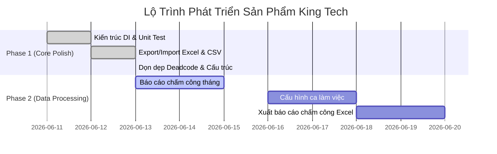

# Báo Cáo Đánh Giá Dự Án Dưới Góc Nhìn Product Manager / Product Owner (PM/PO)

Báo cáo này tập trung phân tích dự án **King Tech Backend** dưới lăng kính quản trị sản phẩm và quản lý kỹ thuật, bao gồm việc đánh giá kiến trúc hệ thống, độ sạch của mã nguồn (deadcode), và tiến độ các tính năng.

---

## 🏗️ 1. Đánh Giá Kiến Trúc Dự Án (Project Structure Review)

Dự án vừa trải qua đợt tái cấu trúc (Refactoring) theo hướng Clean Architecture và dễ kiểm thử hơn.

**Kiến trúc hiện tại: Clean Architecture + Dependency Injection (DI)**
- **Awilix DI Container (`src/container.js`)**: Toàn bộ hệ thống hiện tại không còn cảnh các file `require/import` chéo lẫn nhau gây ra "Spaghetti code". Mọi kết nối giữa Controller - Service - Repository đều được quản lý tập trung tại một Container duy nhất.
- **Request-Scoped DI**: Mỗi request tạo một scope riêng trong `src/app.js`; service được đăng ký scoped, còn repository là stateless singleton. Cách này đủ cô lập service state theo request mà không nhân bản kết nối DB không cần thiết.
- **Khả năng mở rộng (Scalability)**: Nhờ việc tiêm phụ thuộc qua Constructor (`constructor({ employeeRepository })`), việc viết Unit Test trở nên dễ dàng. Thay đổi logic Database chủ yếu nằm ở Repository thay vì lan sang Controller.

---

## 🧹 2. Rà Soát Rác & Mã Chết (Deadcode & Garbage Review)

Hiện tại repo đã dọn các phần chính và `scratch/` được loại khỏi git bằng `.gitignore`. Các claim về `knip`/`depcheck` chỉ nên ghi nhận sau khi chạy lại trong CI hoặc local dev.
- **Phân tích thư viện (Dependencies):** Package hiện tại gọn, chưa thấy dependency thừa rõ ràng qua `npm ls --depth=0`.
- **Rà soát mã chết (Deadcode):** Chưa có bước deadcode scan tự động trong `package.json`; nên bổ sung script riêng nếu muốn giữ tiêu chí này lâu dài.
- **Kịch bản dữ liệu (Seed Data):** File `scripts/seed_100_employees.mjs` hỗ trợ tạo dữ liệu nhân sự/chấm công để thử nghiệm, phụ thuộc server local và token dev.

---

## 🎯 3. Đánh Giá Các Tính Năng Hiện Có (Feature Audit)

### 3.1. Quản Lý Nhân Sự (Employee Management)
*   **Trạng thái:** Hoàn thành xuất sắc.
*   **Điểm nhấn:** Đã tích hợp đầy đủ tính năng Xuất (Export) và Nhập (Import) hàng loạt bằng file Excel/CSV. Hệ thống thông minh tự nhận diện lỗi font BOM UTF-8 và chữ hoa/thường. Có sẵn API lấy file CSV mẫu. Zod validation chặt chẽ.

### 3.2. Chấm Công (Attendance Management)
*   **Trạng thái:** Hoàn thành chức năng cốt lõi. Đang chờ làm Báo Cáo.
*   **Điểm nhấn:** Đã khóa bảo mật tenant-isolation khi chấm công. Dữ liệu giả lập 30 ngày đã sẵn sàng.
*   **Pending:** Cần xây dựng API trả về bảng tổng hợp công tháng (Monthly Summary) phục vụ tính lương.

### 3.3. Bảo Mật & Hệ Thống (Security & System)
*   **Trạng thái:** Hoàn thành nền tảng, còn một số phần cần mở rộng.
*   **Điểm nhấn:**
    *   Tích hợp bộ chặn `Rate Limiter` cơ bản cho login/upload.
    *   Production config đã fail fast nếu thiếu Supabase env hoặc `JWT_SECRET`.
    *   `Audit Logs` hiện đã phủ thao tác nhân sự; cần mở rộng cho các module còn lại trước khi coi là audit toàn hệ thống.

### 3.4. Đơn Hàng & Tồn Kho (Order/Inventory)
*   **Trạng thái:** Chưa active.
*   **Điểm nhấn:** Runtime trả `503 module_inactive` cho `/api/v1/orders` mặc định. Chỉ bật lại bằng `ORDER_MODULE_ACTIVE=true` khi xác định tiếp tục phát triển module này.

---

## 🗺️ 4. Lộ Trình Phát Triển (Roadmap) Tiếp Theo

---

## 💬 5. Định Hướng Phát Triển Tiếp Theo (Sprint Goal)

Dưới góc độ PM/PO, hướng đi nên ưu tiên là bài toán cốt lõi của phân hệ HRM: **Tiền lương và Chấm công**. Module Order/Inventory đã được đánh dấu inactive nên không nằm trong sprint hiện tại.

**Mục tiêu Sprint tới: Hệ thống Báo cáo Tổng hợp Công (Monthly Attendance Summary)**

### Các bước triển khai DEV cần làm:

1. **API Tổng Hợp (Aggregation API):**
   - Viết API `GET /api/v1/attendance/summary` hỗ trợ query theo `month` và `year` (ví dụ: `?month=6&year=2026`).
   - Logic: Tự động gom nhóm (GROUP BY) theo từng nhân sự. Đếm tổng số lần: `Có mặt`, `Vắng`, `Đi trễ`, `Nửa ngày`, `Nghỉ phép`.
   - Tính toán tổng số giờ làm việc (Total Working Hours) dựa trên giờ Check-in/Check-out.

2. **Cấu Hình Giờ Chuẩn (Shift Settings):**
   - Tích hợp thêm cấu hình khung giờ làm việc chuẩn (ví dụ: 08:30 - 17:30) vào module `Settings`.
   - Nếu dữ liệu chấm công không có trạng thái gửi kèm, hệ thống sẽ tự động đối chiếu thời gian Check-in với Giờ Chuẩn để tự gán nhãn `Đi trễ` (late) hoặc `Đúng giờ`.

3. **Xuất Báo Cáo Excel (Payroll Export):**
   - Áp dụng lại thành tựu từ tính năng Export CSV. Trả về bảng báo cáo chấm công của cả tháng ra định dạng Excel để bộ phận Kế toán có thể dùng ngay cho việc tính lương.

> [!IMPORTANT]
> **Yêu cầu (Acceptance Criteria):** API tổng hợp phải chạy cực kỳ tối ưu vì lượng bản ghi rất lớn (khoảng 2.000 - 3.000 dòng mỗi tháng/tenant). Hãy cân nhắc viết lệnh raw SQL hoặc dùng Supabase RPC/Views nếu ORM quá chậm.

Khuyến nghị tiếp theo: lập implementation plan riêng cho API Tổng Hợp Công Tháng, bao gồm schema/query strategy, response contract, và test cases cho nhiều tenant.
